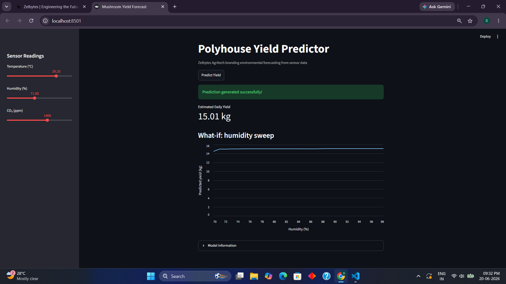

# Agritech Project - Feature Engineering & Temporal Split

## Interactive Yield Prediction Dashboard
An interactive Web Application built using Streamlit to serve real-time greenhouse farm yield predictions from sensor logs.

### Key Features Implemented:
* **Interactive Controls:** Real-time user input sliders for Temperature, Humidity, and CO₂ levels.
* **What-if Analysis Chart:** A dynamic sensitivity line chart tracking yield trends across a full humidity sweep (70% to 98%).
* **Model Trust Signals:** A progressive disclosure expander panel sharing model baseline algorithms, evaluation error limits, and operational metrics.
* **Defensive Error Handling:** Implemented robust user-friendly crash warnings and input boundary constraints.

### Working Application UI


---

## Feature Engineering Definitions
* **temp_humid_interaction**: `(temperature_c * humidity_pct) / 100`
  * *Note*: Captures the combined behavior of atmospheric warmth and moisture levels on crop outputs.

---

## Temporal Train/Test Split Summary
* **Split Type**: Chronological (80% Train / 20% Test)

### Dataset Sizes & Ranges
* **Total Rows**: 365
* **Train Dataset Size**: 292 rows
* **Test Dataset Size**: 73 rows
* **Train Date Range**: 2024-01-01 to 2024-10-18
* **Test Date Range**: 2024-10-19 to 2024-12-30

---

## Run Inference & Testing

To execute automated pytest validations, run:
```bash
pytest