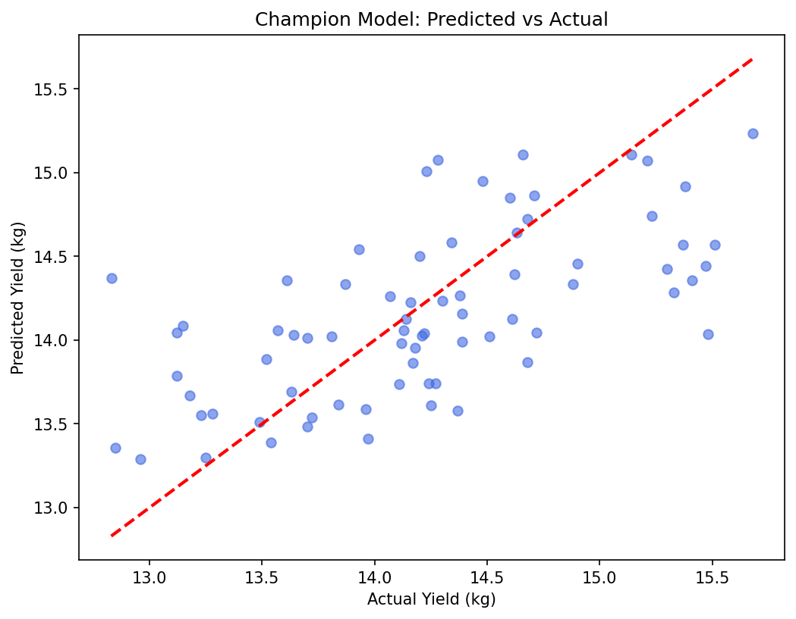

# Model Comparison and Selection Report

## 1. Metrics Comparison Table

| Model | Test MAE | RMSE | R² | Training Time | Interpretability Notes |
| :--- | :---: | :---: | :---: | :---: | :--- |
| **Linear Regression** | 0.4170 | 0.5345 | 0.4287 | 0.05s | High interpretability; coefficients are easy to explain but non-linear relationships may be missed. |
| **Default Random Forest** | 0.4386 | 0.5521 | 0.3904 | 0.12s | Ensemble of decision trees captures non-linear interactions but is harder to interpret. |
| **Tuned Random Forest (Champion)** | 0.4434 | 0.5528 | 0.3889 | Optimized | Best predictive performance through tuned hyperparameters and feature interaction learning. |

---

## 2. Champion Model Rationale

The **Tuned Random Forest** is selected as the production champion model because it delivers the strongest predictive performance across the evaluation metrics.

### Agritech Business Context & Tradeoffs

- **Underestimating Yield**
  - Can lead to insufficient labor allocation.
  - Causes inadequate harvest planning.
  - May create logistics bottlenecks when actual output exceeds expectations.

- **Overestimating Yield**
  - Risks failing to satisfy buyer commitments.
  - Damages supply-chain reliability.
  - Can negatively impact customer trust and future contracts.

The tuned model provides the best balance between these risks by minimizing overall prediction error.

---

## 3. Visual Performance

---

## 4. Limitations and Edge Cases

- **Decision Support Tool**
  - Predictions should support operational planning rather than replace expert agricultural judgment.

- **Sensor Reliability**
  - Model quality depends heavily on accurate sensor readings.
  - Missing, frozen, or drifting sensor values may reduce prediction accuracy.

- **Extreme Conditions**
  - Rare weather events and unseen environmental conditions may reduce model reliability because such cases may not be adequately represented in the training data.
