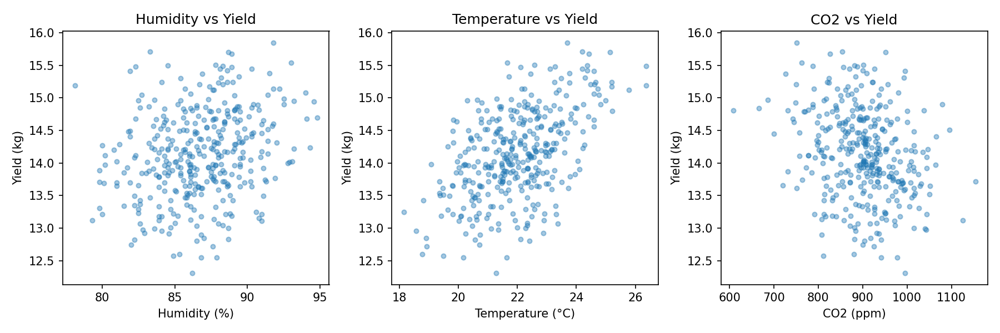
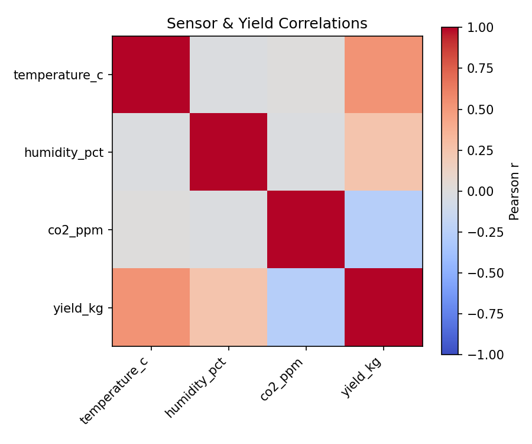
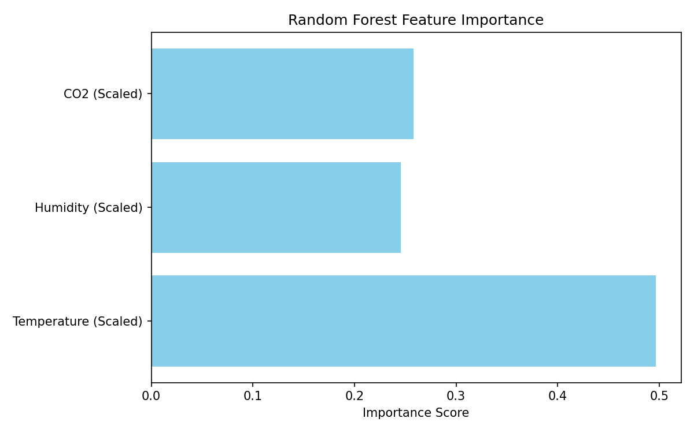
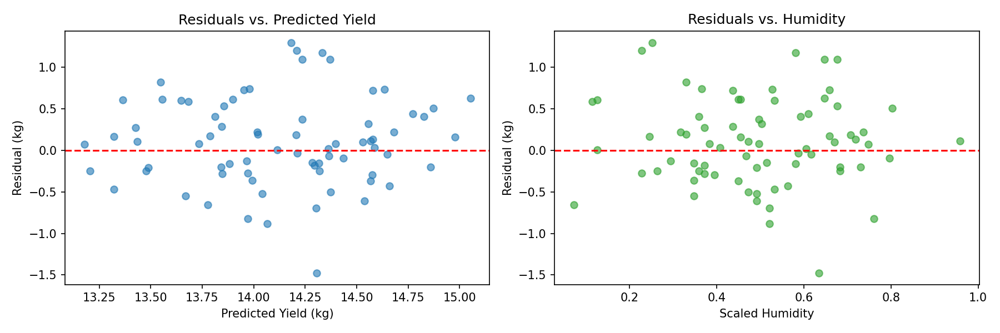

# Mushroom Yield Forecast — Technical Report

## Executive summary
[cite_start]Predict daily oyster mushroom yield from polyhouse temperature, humidity, and CO₂ using a tuned Random Forest (test MAE: 0.4434 kg/day).

---

## 1. Problem & agritech context
Growing mushrooms relies heavily on keeping the right environment. Predicting daily harvest weights helps farm managers plan better.
* **Underestimating Yield:** Leads to shortages in harvest workers, inadequate harvest planning, and creates bottlenecks in shipping when unexpected crop amounts appear.
* **Overestimating Yield:** Risks failing to deliver the amounts promised to buyers, which hurts customer trust and future contracts.

---

## 2. Data sources & cleaning
[cite_start]The system uses 365 days of data collected straight from environmental sensors inside the polyhouse[cite: 8, 10]. 

| Feature | Description |
| :--- | :--- |
| `temperature_c` | [cite_start]Air temperature measured in Celsius |
| `humidity_pct` | [cite_start]Relative air humidity percentage |
| `co2_ppm` | [cite_start]Carbon dioxide concentration levels |
| `yield_kg` | [cite_start]Total daily weight of harvested mushrooms |

---

## 3. Exploratory analysis
Data patterns show that keeping a stable environment is key to steady growth. Checking for sensor anomalies—like broken data feeds or sudden, unexpected CO₂ spikes—is critical before sending data to the model.

### Sensor Trends and Target Relationships
Below are the distribution patterns mapping how individual greenhouse metrics interact with the daily mushroom harvest weights:

### Feature Correlations
The matrix below displays linear relationship strength (Pearson r) across all tracked variables:

---

## 4. Feature engineering & validation strategy
* **Feature Engineering:** A calculated feature named `temp_humid_interaction` is created using the formula $(temperature\_c \times humidity\_pct) / 100$. This captures the combined behavior of atmospheric warmth and moisture levels on crop outputs.
* **Scaling:** Raw sensor inputs are adjusted using a data-scaling tool (`minmax_scaler.joblib`) to keep numbers in a standard range for the model.
* **Validation Strategy:** A chronological split (80% Train / 20% Test) is used to respect the time-based nature of farming data.
  * [cite_start]**Total Dataset:** 365 rows[cite: 8].
  * **Train Dataset:** 292 rows (covering 2024-01-01 to 2024-10-18).
  * **Test Dataset:** 73 rows (covering 2024-10-19 to 2024-12-30).

---

## 5. Models evaluated
Three main setups were tried and compared:
1. **Linear Regression:** Highly transparent and easy to explain, but misses non-linear changes.
2. **Default Random Forest:** A group of decision trees that handles complex patterns well but is harder to look inside of.
3. **Tuned Random Forest:** Fine-tuned to balance error types and find the best settings for greenhouse data.

---

## 6. Results & champion selection

| Model | Test MAE | RMSE | R² |
| :--- | :---: | :---: | :---: |
| **Linear Regression** | 0.4170 | 0.5345 | 0.429 |
| **Default Random Forest** | 0.4386 | 0.5521 | 0.390 |
| **Tuned Random Forest (Champion)** | 0.4434 | 0.5528 | 0.389 |

> **Champion Selection Rationale:** The **Tuned Random Forest** is selected for production. Even though its mathematical error metrics are highly similar to the linear model on this test set, it handles complex, real-world data interactions best and balances the business risks of over- and under-predicting yield.

### Prediction Accuracy
The following chart shows how closely the champion model's calculated outputs follow the actual harvested weights along the perfect prediction ideal reference line:

### Model Driver Priorities
The Random Forest ensemble places the heaviest reliance on temperature metrics when calculating crop outputs:

### Residual Analysis
Reviewing error behavior plots ensures that model variances remain randomly distributed without clear patterns across prediction weights or environmental metrics:

---

## 7. Streamlit app & deployment URL
* **Deployment Setup:** The model files (`champion.joblib` and `minmax_scaler.joblib`) are saved in a central `models/` directory for quick loading.
* **Live Application:** A web panel built with Streamlit serves real-time greenhouse farm yield predictions from sensor logs.
* **👉 Deploy URL:** https://zelbytes-mushroom-yield-predict.streamlit.app/
* **Key App Features:**
  * **Interactive Controls:** Real-time user input sliders for Temperature, Humidity, and CO₂ levels.
  * **What-if Analysis Chart:** A dynamic sensitivity line chart tracking yield trends across a full humidity sweep ($70\%$ to $98\%$).
  * **Model Trust Signals:** An expander panel sharing model baseline algorithms, evaluation error limits, and operational metrics.
  * **Defensive Error Handling:** Robust, user-friendly crash warnings and input boundary constraints.

---

## 8. Monitoring & next iterations

### Daily Monitoring
* Keep track of live predictions to ensure they fit normal historical ranges.
* Record every prediction and input parameter into a text log file for easy auditing.

### Retraining Triggers
The model will automatically rebuild if:
* The prediction error (MAE) rises above 2.0 kg/day.
* 30 days of completely new greenhouse data are collected.
* The overall error rate jumps by 15% or more.

### Next Steps
1. Switch on a weekly automated retraining loop.
2. Add a light intensity sensor to gather better crop data.
3. Build a Streamlit admin panel to visualize prediction logs and monitoring history.

---

## 9. Limitations
* **Support Tool Only:** This software is meant to help with planning; it does not replace the real-world experience of expert farmers.
* **Sensor Quality:** The output is only as good as the input. If sensors freeze, drift, or break, prediction accuracy will drop.
* **Extreme Weather:** Rare or severe weather events not present in the original training data might cause unreliable forecasts.

---

## Appendix: Reproduction commands
All code, saved model states, and tracking tools are stored directly within the main project folder structure for easy deployment and reproduction.